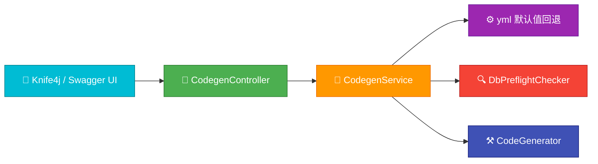

# codegen-java · 独立代码生成服务


> 🚀 面向 MySQL 的代码生成服务，支持“请求参数覆盖 + yml 默认值回退”，一键生成 `entity/service/service.impl/mapper/xml/controller` 标准分层代码。

---

## 架构图



---

## 快速开始

- 构建：`mvn -q -f codegen-java/pom.xml -DskipTests package`
- 启动（dev）：`mvn -f codegen-java/pom.xml spring-boot:run`
- 文档 UI：`http://localhost:8090/swagger-ui/index.html` 或 `http://localhost:8090/doc.html`

---

## 默认值与回退

- 当请求体未传或传空时，自动使用 yml 默认值：
  - `codegen.module / codegen.package / codegen.tables / codegen.outputRoot`
  - `spring.datasource.url / username / password`
- 合并规则：请求参数优先，其次 yml 默认值；两者都缺失则返回 400。
- 关键实现：
  - 默认值合并 `codegen-java/src/main/java/com/dowson/codegen/service/CodegenService.java:33-44`
  - 控制器空体支持 `codegen-java/src/main/java/com/dowson/codegen/controller/CodegenController.java:39-43`

---

## 接口说明

- POST `/codegen/run`（执行生成，支持干跑）
  - 请求体可为空；`dryRun=true` 仅返回计算信息，不连接数据库、不落盘
  - 返回：`Result<CodegenResultVo>`，包含 `outputPath/module/parentPackage/tableCount/timeMs/dryRun`
- GET `/codegen/config`（查看当前 yml 默认配置）

### 示例 · 干跑（空体）
```json
{}
```

### 示例 · 真实生成（覆盖默认数据源）
```json
{
  "dryRun": false,
  "url": "jdbc:mysql://localhost:3306/test?allowPublicKeyRetrieval=true&useSSL=false&serverTimezone=Asia/Shanghai&characterEncoding=utf8",
  "username": "root",
  "password": "123456"
}
```

---

## 配置示例（dev）

```yaml
spring:
  datasource:
    url: jdbc:mysql://localhost:3306/${codegen.db.name}?allowPublicKeyRetrieval=true&useSSL=false&serverTimezone=Asia/Shanghai&characterEncoding=utf8
    username: root
    password: 123456
    driver-class-name: com.mysql.cj.jdbc.Driver

codegen:
  outputRoot: d:/Java_learn/java_learn/demo
  module: test-demo
  package: com.dowson.testdemo
  tables: author,book,book_category

server:
  port: 8090
```

---

## 生成器配置链（注释）

- `.globalConfig`：作者、源码输出目录、禁用生成后自动打开目录
- `.packageConfig`：父包与子包命名、XML 输出路径
- `.strategyConfig`：包含表、前缀剥离、Lombok/字段注解、逻辑删除/版本字段、文件命名格式
- `.templateEngine`：Velocity 模板引擎
- `.execute`：执行生成

代码参考：`codegen-java/src/main/java/com/dowson/codegen/CodeGenerator.java:25-49`

---

## 错误排查

- 🔑 `Public Key Retrieval is not allowed`：在 JDBC URL 添加 `allowPublicKeyRetrieval=true`
- 🗃️ 表不存在：检查库中是否存在 `codegen.tables` 指定的表名；可通过请求体覆盖数据源
- 🔌 端口占用：将 `server.port` 改为未占用端口，例如 `8090`

---

## 版权与致谢

- 依赖：Spring Boot、MyBatis-Plus、Velocity、SpringDoc、Knife4j
- 许可：MIT

